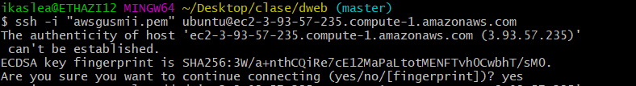
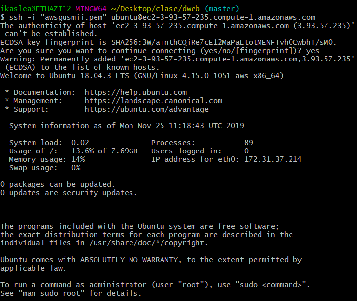

# Documentacion para 2 eval

## 1.-Como Conectarse

Para poder concetarte abriremos un terminal con capacidad para ejecutar comandos de linux y ejecutaremos el siguiente comando.

> ssh -i "clave privada" ubuntu@ec2-3-93-57-235.compute-1.amazonaws.com

En caso de que tengas algun problema hay que asegurarse de que estes en el directorio que se encuentre la clave y si eso no funciona ejecuta el siguiente comando.

>chmod 400 awsgusmii.pem

Como veis ya estamos conectados y diremos que si a la opcion de fingerprint para que no nos pida de nuevo la clave al iniciar sesion.

Despues de responder a esa opcion ya estaremos conectados :)

Al conectarse tendremos que habilitar los puertos http y https para poder conectarnos.

## 2.-Como Desconectarse

Para poder desconectarse bastara con que ejecutemos el siguiente comando.

>exit

## 3.-Poner la maquina al dia

Al entrar la maquina estara obsoleta por que no esta al dia, para arreglar eso y ponerlo al dia bastara con que ejecutemos un comando.

>sudo apt-get update

## 4.-Descargar apache 

Para descargar apache bastara con poner el siguiente comando. Haremos esto para poder tener un servidor. 

>sudo apt-get install apache2

Pulsaremos que si y ya estara todo instalado

## 5.-Descargar MySql

Para poder empezar la instalacion ejecutaremos el siguiente comando y luego ejecutaremos un script de seguridad que incluye.

>1.-sudo apt install mysql-server

>2.-sudo mysql_secure_installation

Aqui configuraremos como queramos y crearemos una contraseña que guardaremos en un fichero para no olvidarlo.

Y con esto ya terminaremos la instalacion de Mysql, hasi podremos gestionar bases de datos.

## 6.-Descargar PHP y PHPMyAdmin

Para poder empezar con la instalacion del php ejecutaremos el siguiente comando.

>sudo apt install php libapache2-mod-php php-mysql

Ahora pasaremos a instalar PHPMyAdmin y para ello ejecutaremos el siguiente comando

>sudo apt-get install phpmyadmin php-mbstring php-gettext

Al aceptar lo siguiente que nos saldra sera esto, aqui escogeremos el servidor que queramos que se configure automaticamente para poder usar PHPMyAdmin.

Escogeremos apache pulsando el espacio y luego continuaremos, lo siguiente que nos saldra sera 

Una vez aceptando esto nos pedira que introduzcamos una contraseña para la aplicaion de  PHPMyAdmin.Una vez confirmar la contraseña nos sacara de esa vista y ya solo nos quedara  habilitar las extensiones PHP. Para ello usaremos los siguientes comandos.

>sudo phpenmod mcrypt
>sudo phpenmod mbstring

Para terminar y comprobar que esta todo bien escribiremos esto en el navegador que usamos

Una vez estando ya en esta vista, crearemos un usuario para que todo sea mas comodo, para ello volveremos al terminal para introducir este comando para poder loguearnos.

>sudo mysql -u root -p

Una vez introducido esto nos loguearemos con la contraseña que pusimos antes en la instalacion. Al entrar ejecutaremos el comando para crear el usuario.

>CREATE USER 'nombre_usuario'@'localhost' IDENTIFIED BY 'tu_contrasena';

Con eso crearemos el usuario y estableceremos su contraseña. Ahora le daremos permisos a ese usuario para que no tenga ningun problema, para poder hacer eso introduciremos el siguiente comando.

>GRANT ALL PRIVILEGES ON * . * TO 'nombre_usuario'@'localhost';

Como veis ya tiene los permisos, ahora tendremos que guardar todo para que se apliquen los cambios en los privilegios.

>FLUSH PRIVILEGES;

Ahora ya solo quedaria loguearse en el navegador ya que con esto ya tendriamos un nuevo usuario creado. Ahora 

