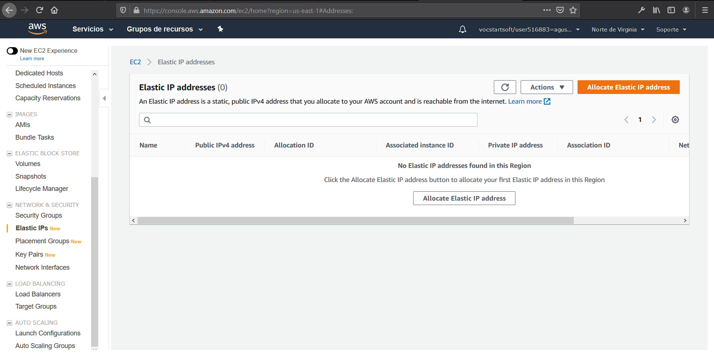
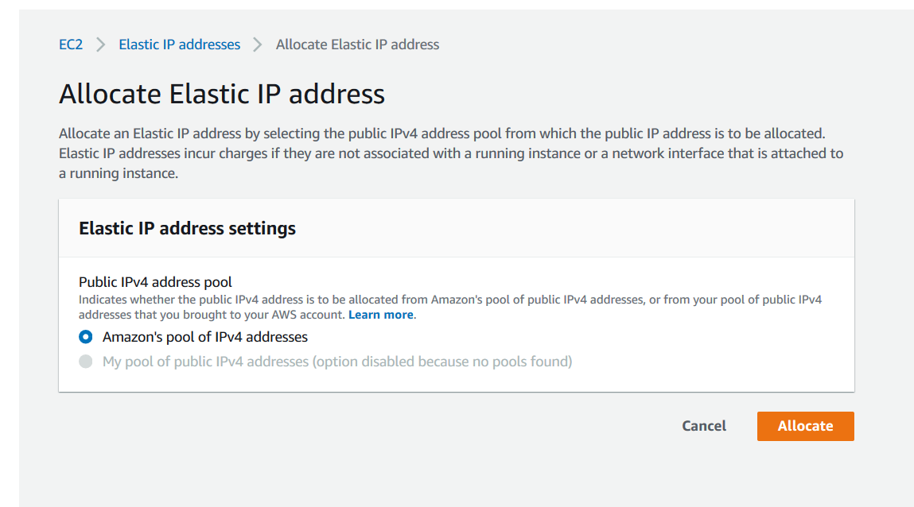
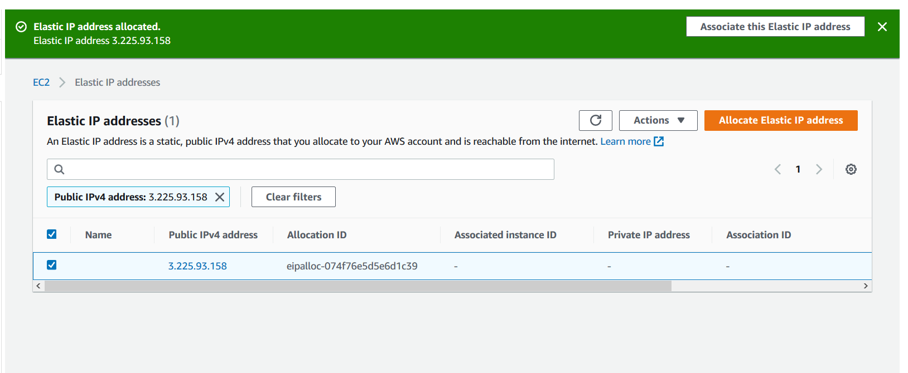
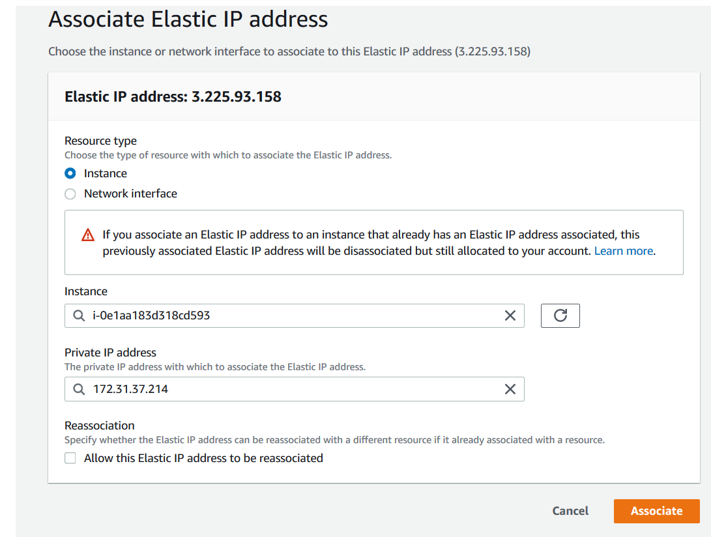

# Documentacion para 2 eval 

# Solventar problemas de direccionamiento

El objetivo sera poder usar la misma URL siempre, para empezar nos loguearemos y iremos al apartado de **Elastics IPs**.

---

Para empezar haremos click en el boton **Allocate Elastic IP address** y nos saldra lo siguiente

---

Este paso es sencillo, usaremos las ips de amazon que tenemos nosotros y al dar allocate ya directamente nos saldran.

---

Ahora ya solo queda escoger cual asociaremos con la ip elastica. Para ello haremos click en el boton de arriba para poder asociar la ip, al hacerlo nos saldra lo siguiente.

Bastara con hacer click en instance para usar lo de la maquina y en los demas al hacer click nos saldran ya los datos de la maquina que hemos escogido. Dejaremos sin aceptar la opcion de que se pueda reasociar para que no cometamos ningun error. Una vez hecho esto ya habremos terminado.