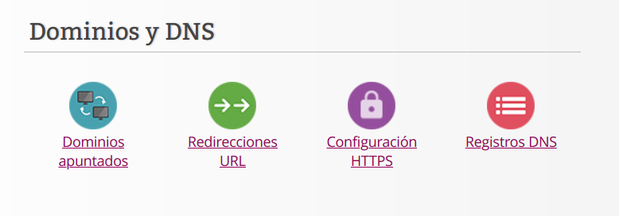
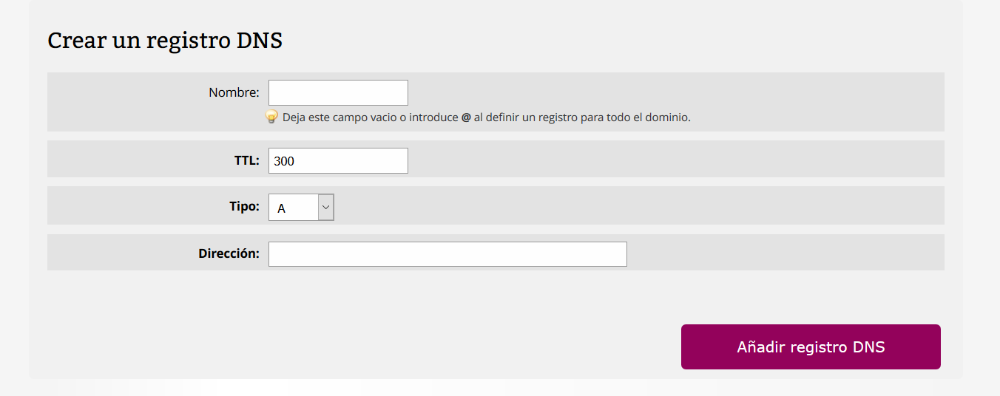
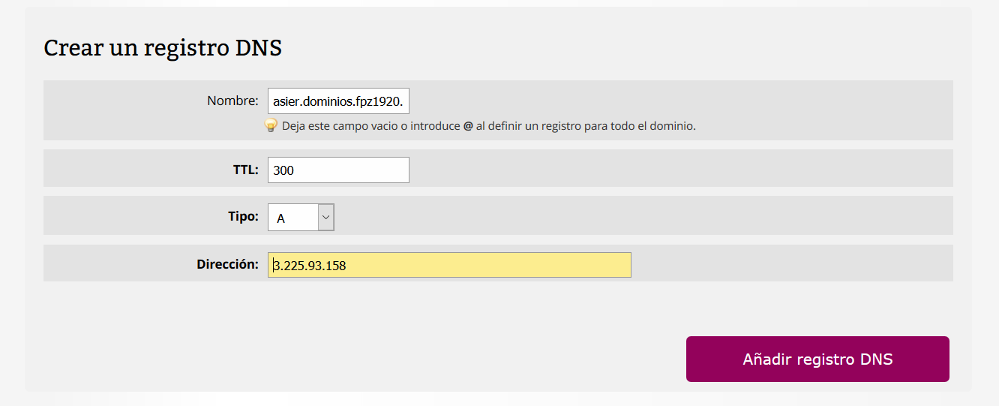
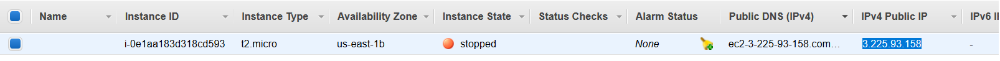

# Documentacion para 2 eval 

# Gestión de DNS

En esta documentacion aprenderemos a como gestionar la DNS de nuestro dominio. Para ello volveremos a entrar en nuestra pagina de hosting y iremos al siguiente apartado.

Una vez estemos en este apartado entraremos en  *Registros DNS*

Para poder crear el registro hay varias cosas que tendreis que saber, en esta documentacion solo veremos los tipos y no profundicaremos mucho.

>*A*.- Este registro DNS tambien conocido como address se usa para traducir los nombres  de los servidores a ipv4, por lo tanto, este es el que usaremos

>*AAAA*.- Este registro DNS tambien conocido como address se usa para traducir los nombres  de los servidores a ipv6

>*CNAME*.- Este tipo de registro se usa para crear un alias al servidor

>*SRV*.- Service record (SRV record).

>*TXT*.- Es un tipo de registro DNS que da los datos en formato de texto para que otros que no pertenezcan a tu dominio puedan leerlo, tanto personas como maquinas.

Una vez sabiendo para que es cada tipo  rellenaremos los campos.

Antes de añadir el registro DNS primero comprobaremos que la direccion ip es la correcta, para eso iremos a nuestro apartado de instances y ahi veremos la ip de la maquina que tenemos.

