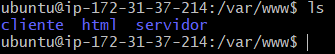
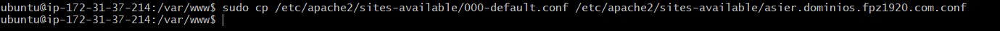
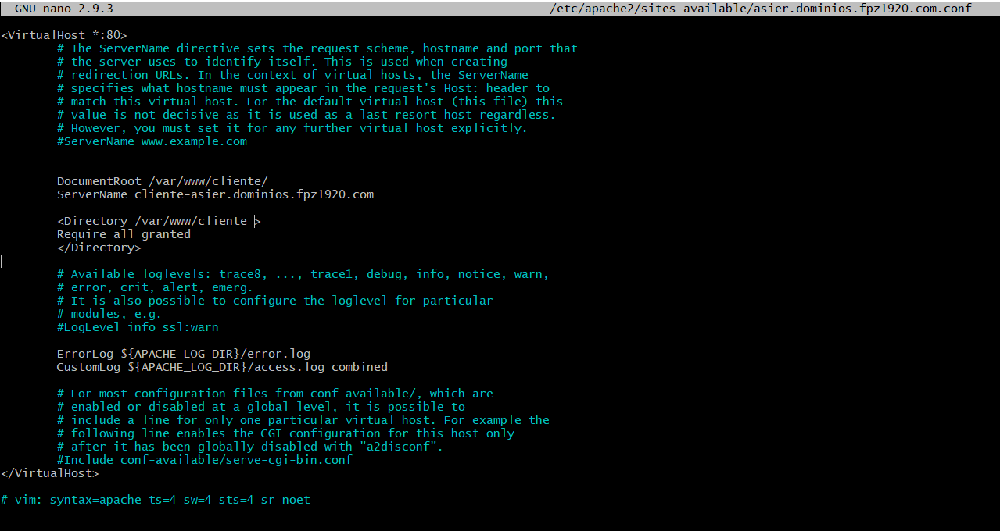
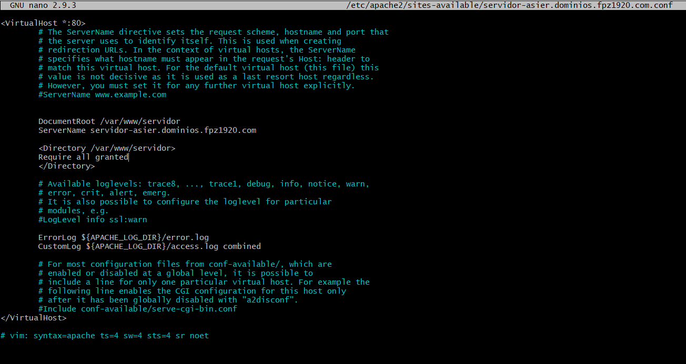
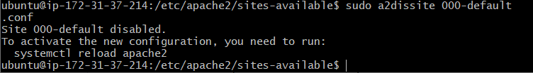
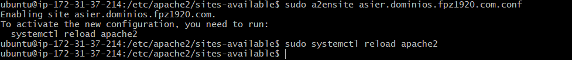
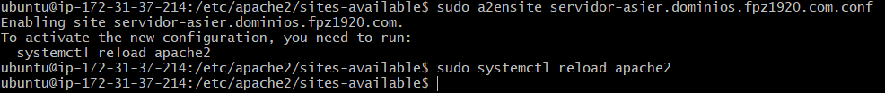
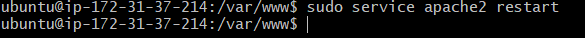
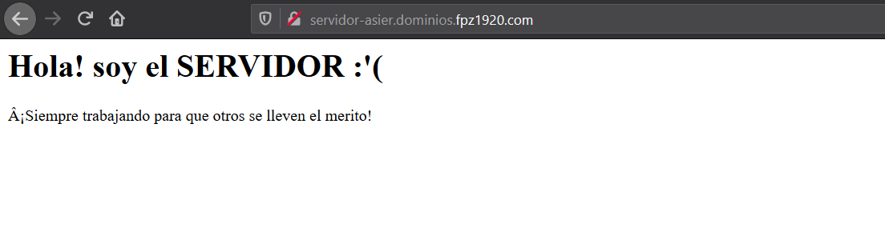

# Documentacion para 2 eval 

# Virtual Hosts

Empezaremos creando una carpeta con su index en el directorio " /var/www" Crearemos una para cliente y otra para servidor.

Dentro del index Pondremos algo para que se pueda visualizar al finalizar todo. Bastara con escribir dentro para poder comprobar que esta bien al escribir la direccion en el navegador.

Repetimos esto tanto con cliente y servidor, asi tendremos una base del fichero. Basicamente estamos copiando el fichero y al mismo tiempo asignando el nombre del nuevo fichero.

Para poder editarlo iremos al directorio y usaremos el comando "<b>nano</b>" para poder editar el fichero nuevo.

Como se ve tendremos que escribir el DocumentRoot y el ServerName, tambien le daremos permisos. Repetiremos esto con los dos

Ahora tenemos creados los archivos VirtualHost, ya solo queda habilitarlos para ello usaremos el comando "a2ensite".

Antes de eso tambien tendremos que deshabilitar el que viene por defecto.

Despues de habilitarlo tendremos que reiniciar apache, para ello usaremos el comando que nos indica

Una vez hecho esto ya abremos finalizado, ahora comprobaremos si esta bien todo, para ello iremos al navegador y escribiremos la direccion.

