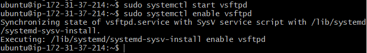
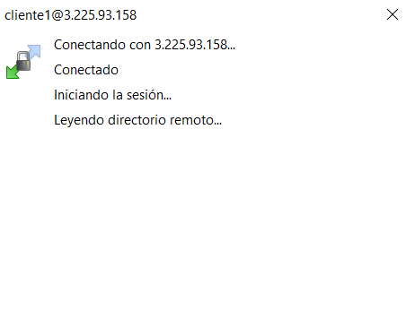

# Documentacion para 2 eval 

# Servidor FTP

Para poder empezar con el servidor FTP lo primero crearemos una nueva regla en el apartado de security groups.

Haciendo click ahi nos llevara a una vista distinta en el que podremos editar las "inbound rules" y añadiremos uno nuevo con el puerto 21

Una vez añadido la nueva regla nos conectaremos a la maquina y crearemos tres usuarios.

>Crear usuarios

Ahora instalaremos el vsftp y despues iniciaremos el servicio y lo activaremos.

>Instalacion

>Iniciar y activar

Ahora crearemos una copia del archivo de configuracion para asegurar de que no pasara nada si cometemos algun fallo, despues entraremos a editar el archivo original

Ahora que estamos dentro borraremos todo su contenido y escribiremos las siguientes filas

una vez teniendo estas lineas añadidas usaremos el siguiente comando para añadir los usuarios ftp

>sudo useradd -g ftp -d /var/www/carpeta deseada/ -c "Tipo usuario"

Nosotros ya los tenemos creado pero para hacer la prueba crearemos otro igual solo que le añadiremos un 1 al final del nombre y despues le asignaremos contraseña

Despues de esto entraremos el el WinSCP y meteremos los datos del ultimo usuario que hemos creado y la ip de la maquina. Al meter todos los datos bien y al seguir todos los pasos se nos loguera y nos conectaremos con sin problemas

