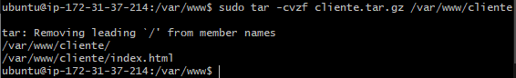
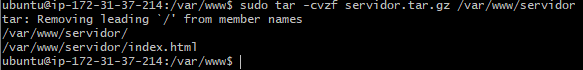
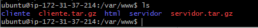
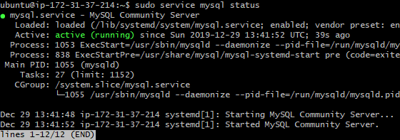
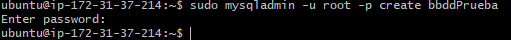
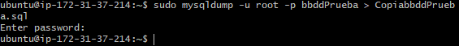

# Documentacion para 2 eval 

# Comprimir y Empaquetar carpetas

Lo primero que haremos sera seleccionar las carpetas de cliente y servidor que vayamos a comprimir, una vez que los tenemos localizados usaremos el siguiente comando.

>sudo -cvfz nombre_del_ archivo.tar.gz ruta_de_la_carpeta_a_comprimir

Una vez que ya las tengamos comprimidas usaremos el comando "ls" para comprobar que se han comprimido de manera correcta.

# Volcar y Empaquetar bases de datos

Lo primero que haremos sera ver si el servicio MySql esta activo, para ello usaremos el siguiente comando

>sudo service mysql status

Al ver que la bbdd esta activa empezaremos creando una bb de datos para este ejercicio.Para ello usaremos el siguiente comando

>sudo mysqladmin -u root -p create nombre_de_la_base_de_datos

Al tener la base de datos ya creada solo nos quedaria Volcarla, par ello usaremos el siguiente comando.

>sudo mysqldump -u root -p nombre_de_la_base_de_datos > nombre_del_archivo_de_descarga.sql

Una vez hecho esto ya tendriamos la bbdd descargada.