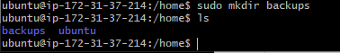
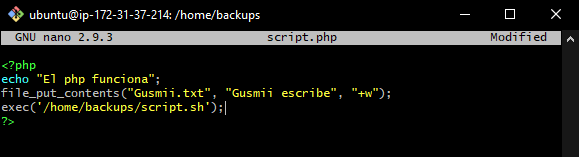
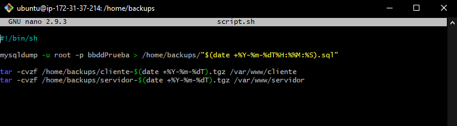
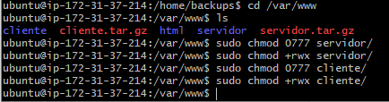
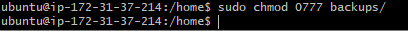
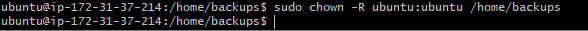

# Documentacion para 2 eval 

# Automatizar copias de seguridad

Para poder empezar crearemos una carpeta en la que se guarden los backups que crearemos.

>sudo mkdir backups

Ahora crearemos un php para ejecutar el sh que vaya a hacer los backups.

Ya que tenemos el php que ejecute el php crearemos el sh ahora.

Una vez tengamos el script creado tendremos que dar permisos en la carpeta en la que esta la web creada.

Ahora que tenemos esto listo, tendremos que volver a la carpeta de backups y ahi darle permisos. Despues cambiaremos el usuario para que no haya ningun error en caso de que pasara algo.

Ahora ya solo queda automatizarlo, para ello editaremos el archivo de /etc/crontab

